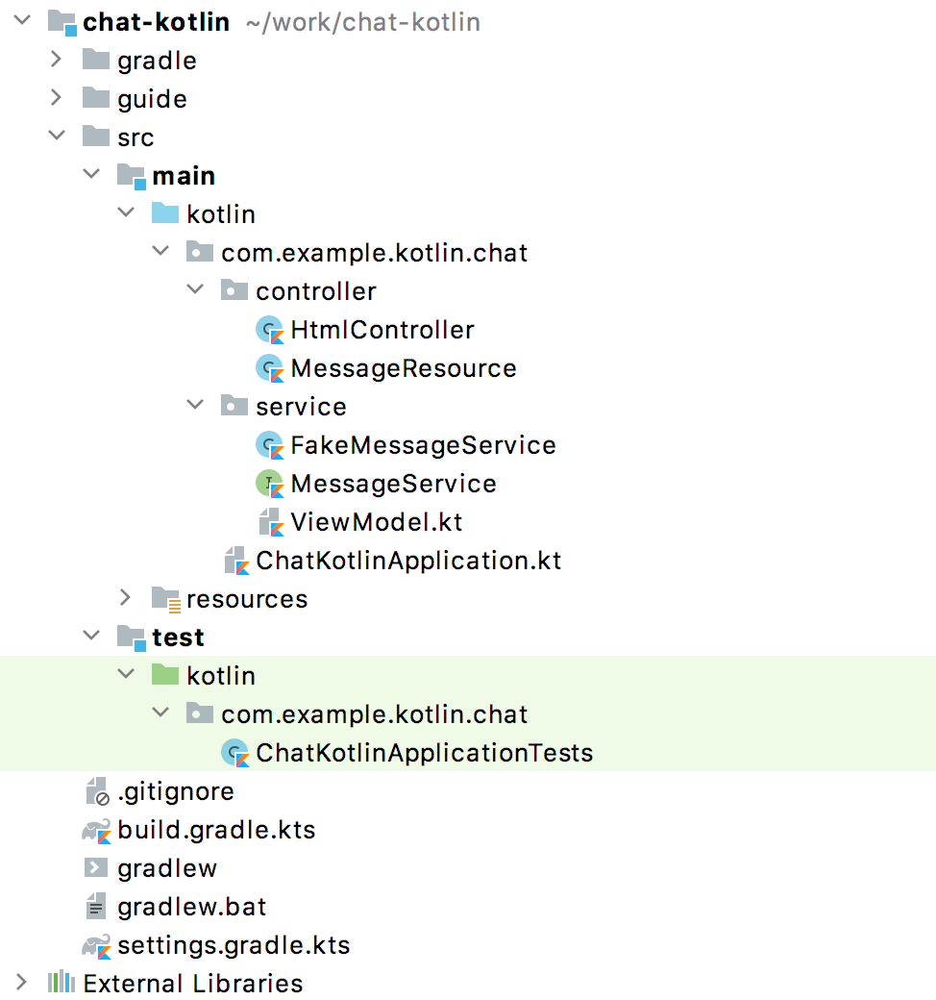
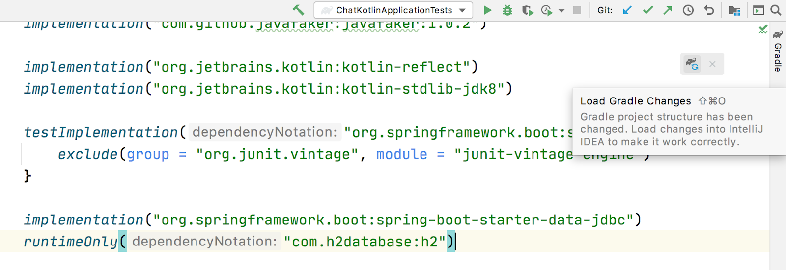
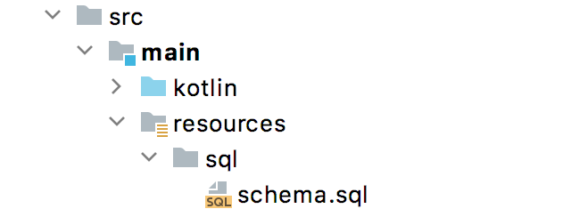

:toc:
:icons: font
:source-highlighter: prettify
:project_id: tut-spring-webflux-kotlin-rsocket
:tabsize: 2

== Introduction

The tutorial shows you how to build a simple chat application using Spring Boot and Kotlin. You will learn about the benefits of using Kotlin for server-side development from a syntax perspective.

We’ll start with a minimal implementation of the application, and we will evolve it step by step.At the start, the application will generate and display fake messages and use the classical blocking request-response model to get data to the UI.Through the tutorial, we are going to evolve the application by adding persistence and extensions, and migrating to a non-blocking streaming style for serving the data from the backend to the UI.

The tutorial consists of 5 parts:

* Part 1: Initial setup and introduction to the project
* Part 2: Adding persistence and integration tests
* Part 3: Implementing extensions
* Part 4: Refactoring to Spring WebFlux with Kotlin Coroutines
* Part 5: Streaming with RSocket

This tutorial is designed for Java developers who have already had their hands on Spring MVC / WebFlux and want to see how to use Kotlin with Spring.

== Part 1: Initial setup and introduction to the project

To start working on this tutorial, we'll need one of the latest versions of IntelliJ IDEA – any version from 2018.1 onwards.You can download the latest free community version [here](https://www.jetbrains.com/idea/download).

This project is based on Spring Boot 2.4.0, which requires Kotlin 1.4.10. Make sure version 1.4+ of the Kotlin plugin is installed.To update the Kotlin plugin, use `Tools | Kotlin | Configure Kotlin Plugin Updates`.

=== Downloading the project

Clone the repository from IntelliJ IDEA by choosing `File | New | Project from Version Control`.

image::./images/download-from-vcs.png[]

Specify the project path: http://github.com/kotlin-hands-on/kotlin-spring-chat.

image::./images/download-from-vcs-github.png[]

Once you clone the project, IntelliJ IDEA will import and open it automatically.
Alternatively, you can clone the project with the command line:

[source,bash]
$ git clone https://github.com/kotlin-hands-on/kotlin-spring-chat.

=== Solution branches

Note that the project includes solution branches for each part of the tutorial. You can browse all the branches in the IDE by invoking the Branches action:

image::./images/intellij-git-branches.png[]

Or you can use the command line:

[source,bash]
git branch -a

It is possible to use the `Compare with branch` command in IntelliJ IDEA to compare your solution with the proposed one.

image::./images/intellij-git-compare-with-branch.png[]

For instance, here is the list differences between the `initial` branch and `part-2` branch:

image::./images/intellij-git-compare-with-branch-diff.png[]

By clicking on the individual files, you can see the changes at a line level.

image::./images/intellij-git-compare-with-branch-file-diff.png[]

This should help you in the event that you have any trouble with the instructions at any stage of the tutorial.

=== Launching the application
The `main` method for the application is located in the `ChatKotlinApplication.kt` file. Simply click on the gutter icon next to the main method or hit the `Alt+Enter` shortcut to invoke the launch menu in IntelliJ IDEA:

image::./images/intellij-run-app-from-main.png[]

Alternatively, you can run the `./gradlew bootRun` command in the terminal.

Once the application starts, open the following URL: http://localhost:8080. You will see a chat page with a collection of messages.

image::./images/chat.gif[]

In the following step, we will demonstrate how to integrate our application with a real database to store the messages.

=== Project overview

Let's take a look at the general application overview. In this tutorial, we are going to build a simple chat application that has the following architecture:

image::./images/application-architecture.png[]

Our application is an ordinary 3-tier web application. The client facing tier is implemented by the `HtmlController` and `MessagesResource` classes. The application makes use of server-side rendering via the _Thymeleaf_ template engine and is served by `HtmlController`. The message data API is provided by `MessagesResource`, which connects to the service layer.

The service layer is represented by `MessagesService`, which has two different implementations:

*   `FakeMessageService` – the first implementation, which produces random messages
*   `PersistentMessageService` - the second implementation, which works with real data storage. We will add this implementation in part 2 of this tutorial.

The `PersistentMessageService` connects to a database to store the messages. We will use the H2 database and access it via the Spring Data Repository API.

After you have downloaded the project sources and opened them in the IDE, you will see the following structure, which includes the classes mentioned above.

Under the `main/kotlin` folder there are packages and classes that belong to the application. In that folder, we are going to add more classes and make changes to the existing code to evolve the application.

In the `main/resources` folder you will find various static resources and configuration files.

The `test/kotlin` folder contains tests. We are going to make changes to the test sources accordingly with the changes to the main application.

The entry point to the application is the `ChatKotlinApplication.kt` file. This is where the `main` method is.

==== HtmlController

`HtmlController` is a `@Controller` annotated endpoint which will be exposing an HTML page generated using the https://www.thymeleaf.org/doc/tutorials/3.0/thymeleafspring.html[Thymeleaf template engine]

[source,kotlin]
-----
import com.example.kotlin.chat.service.MessageService
import com.example.kotlin.chat.service.MessageVM
import org.springframework.stereotype.Controller
import org.springframework.ui.Model
import org.springframework.ui.set
import org.springframework.web.bind.annotation.GetMapping

@Controller
class HtmlController(val messageService: MessageService) {
   @GetMapping("/")
   fun index(model: Model): String {
       val messages = messageService.latest()

       model["messages"] = messages
       model["lastMessageId"] = messages.lastOrNull()?.id ?: ""
       return "chat"
   }
}
-----

💡One of the features you can immediately spot in Kotlin is the https://kotlinlang.org/spec/type-inference.html[type inference]. It means that some type of information in the code may be omitted, to be inferred by the compiler.

In our example above, the compiler knows that the type of the `messages` variable is `List&lt;MessageVM&gt;` from looking at the return type of the `messageService.latest()` function.

💡Spring Web users may notice that `Model` is used in this example as a `Map` even though it does not extend this API. This becomes possible with https://docs.spring.io/spring-framework/docs/5.0.0.RELEASE/kdoc-api/spring-framework/org.springframework.ui/index.html[another Kotlin extension], which provides overloading for the `set` operator. For more information, please see the https://kotlinlang.org/docs/reference/operator-overloading.html[operator overloading] documentation.

💡 https://kotlinlang.org/docs/reference/null-safety.html[Null safety] is one of the most important features of the language. In the example above, you can see an application of this feature: `messages.lastOrNull()?.id ?: "".` First, `?.` is the https://kotlinlang.org/docs/reference/null-safety.html#safe-calls[safe call] operator, which checks whether the result of `lastOrNull()` is `null` and then gets an `id`. If the result of the expression is `null`, then we use an https://kotlinlang.org/docs/reference/null-safety.html#elvis-operator[Elvis operator] to provide a default value, which in our example is an empty string (`""`).

==== MessageResource

We need an API endpoint to serve polling requests. This functionality is implemented by the `MessageResource` class, which exposes the latest messages in JSON format.

If the `lastMessageId` query parameter is specified, the endpoint serves the latest messages after the specific message-id, otherwise, it serves all available messages.

[source,kotlin]
-----
@RestController
@RequestMapping("/api/v1/messages")
class MessageResource(val messageService: MessageService) {

   @GetMapping
   fun latest(@RequestParam(value = "lastMessageId", defaultValue = "") lastMessageId: String): ResponseEntity<List<MessageVM>> {
       val messages = if (lastMessageId.isNotEmpty()) {
           messageService.after(lastMessageId)
       } else {
           messageService.latest()
       }

       return if (messages.isEmpty()) {
           with(ResponseEntity.noContent()) {
               header("lastMessageId", lastMessageId)
               build<List<MessageVM>>()
           }
       } else {
           with(ResponseEntity.ok()) {
               header("lastMessageId", messages.last().id)
               body(messages)
           }
       }
   }

   @PostMapping
   fun post(@RequestBody message: MessageVM) {
       messageService.post(message)
   }
}
-----

💡In Kotlin, `if` https://kotlinlang.org/docs/reference/control-flow.html#if-expression[is an expression], and it returns a value. This is why we can assign the result of an `if` expression to a variable: `val messages = if (lastMessageId.isNotEmpty()) { … }`

💡 The Kotlin standard library contains https://kotlinlang.org/docs/reference/scope-functions.html[scope functions] whose sole purpose is to execute a block of code within the context of an object. In the example above, we use the https://kotlinlang.org/docs/reference/scope-functions.html#with[`with()`] function to build a response object.

==== FakeMessageService

`FakeMessageService` is the initial implementation of the `MessageService` interface. It supplies fake data to our chat. We use the http://dius.github.io/java-faker/[Java Faker] library to generate the fake data. The service generates random messages using famous quotes from Shakespeare, Yoda, and Rick & Morty:

[source,kotlin]
-----
@Service
class FakeMessageService : MessageService {

    val users: Map<String, UserVM> = mapOf(
        "Shakespeare" to UserVM("Shakespeare", URL("https://blog.12min.com/wp-content/uploads/2018/05/27d-William-Shakespeare.jpg")),
        "RickAndMorty" to UserVM("RickAndMorty", URL("http://thecircular.org/wp-content/uploads/2015/04/rick-and-morty-fb-pic1.jpg")),
        "Yoda" to UserVM("Yoda", URL("https://news.toyark.com/wp-content/uploads/sites/4/2019/03/SH-Figuarts-Yoda-001.jpg"))
    )

    val usersQuotes: Map<String, () -> String> = mapOf(
       "Shakespeare" to { Faker.instance().shakespeare().asYouLikeItQuote() },
       "RickAndMorty" to { Faker.instance().rickAndMorty().quote() },
       "Yoda" to { Faker.instance().yoda().quote() }
    )

    override fun latest(): List<MessageVM> {
        val count = Random.nextInt(1, 15)
        return (0..count).map {
            val user = users.values.random()
            val userQuote = usersQuotes.getValue(user.name).invoke()

            MessageVM(userQuote, user, Instant.now(),
                      Random.nextBytes(10).toString())
        }.toList()
    }

    override fun after(lastMessageId: String): List<MessageVM> {
        return latest()
    }

    override fun post(message: MessageVM) {
        TODO("Not yet implemented")
    }
}
-----

💡 Kotlin features https://kotlinlang.org/docs/reference/lambdas.html#function-types[functional types], which we often use in a form of https://kotlinlang.org/docs/reference/lambdas.html#lambda-expressions-and-anonymous-functions[lambda expressions]. In the example above, `userQuotes` is a map object where the keys are strings and the values are lambda expressions. A type signature of `() -> String` says that the lambda expression takes no arguments and produces `String` as a result. Hence, the type of `userQuotes` is specified as `Map&lt;String, () -> String&gt;`

💡 The `mapOf` function lets you create a map of `Pair`s, where the pair’s definition is provided with an https://kotlinlang.org/docs/reference/extensions.html[extension] method `&lt;A, B&gt; A.to(that: B): Pair&lt;A, B&gt;`.

💡 The `TODO()` function plays two roles: the reminder role and the stab role, as it always throws the `NotImplementedError` exception.

The main task of the `FakeMessageService` class is to generate a random number of fake messages to be sent to the chat’s UI. The `latest()` method is the place where this logic is implemented.

[source,kotlin]
-----
val count = Random.nextInt(1, 15)
return (0..count).map {
    val user = users.values.random()
    val userQuote = usersQuotes.getValue(user.name).invoke()

    MessageVM(userQuote, user, Instant.now(), Random.nextBytes(10).toString())
  }.toList()
-----

In Kotlin, to generate a https://kotlinlang.org/docs/reference/ranges.html[range] of integers all we need to do is say `(0..count)`. We then apply a `map()` function to transform each number into a message.

Notably, the selection of a random element from any collection is also quite simple. Kotlin provides an extension method for collections, which is called `random()`. We use this extension method to select and return a user from the list: `users.values.random()`

Once the user is selected, we need to acquire the user’s quote from the `userQuotes` map. The selected value from `userQuotes` is actually a lambda expression that we have to invoke in order to acquire a real quote: `usersQuotes.getValue(user.name).invoke()`

Next, we create an instance of the `MessageVM` class. This is a view model used to deliver data to a client:

[source,kotlin]
-----
data class MessageVM(val content: String, val user: UserVM, val sent: Instant, val id: String? = null)
-----

💡For https://kotlinlang.org/docs/reference/data-classes.html[data classes], the compiler automatically generates the `toString`, `equals`, and `hashCode` functions, minimizing the amount of utility code that you have to write.

== Part 2: Adding persistence and integration tests

In this part, we will implement a persisting version of the `MessageService` interface using Spring Data JDBC and H2 as the database. We will introduce the following classes:

*   `PersistentMessageService` – an implementation of the `MessageService` interface, which will interact with the real data storage via the Spring Data Repository API.
*   `MessageRepository` – a repository implementation used by `MessageService.`

=== Adding new dependencies
First of all, we have to add the required dependencies to the project. For that, we need to add to the following lines to the `dependencies` block in the` build.gradle.kts `file:

[source,kotlin]
-----
implementation("org.springframework.boot:spring-boot-starter-data-jdbc")
runtimeOnly("com.h2database:h2")
-----

⚠️ Note, in this example, we use `spring-data-jdbc` as a lightweight and straightforward way to use JDBC in Spring Framework. If you wish to see an example of JPA usage, please see the following https://spring.io/guides/tutorials/spring-boot-kotlin/?#_persistence_with_jpa[blog post].

⚠️ To refresh the list of the project dependencies, click on the little elephant icon that appears in the top right-hand corner of the editor.

=== Create database schema and configuration

Once the dependencies are added and resolved, we can start modeling our database schema. Since this is a demo project, we will not be designing anything complex and we’ll stick to the following structure:

[source,sql]
-----
CREATE TABLE IF NOT EXISTS messages (
  id                     VARCHAR(60)  DEFAULT RANDOM_UUID() PRIMARY KEY,
  content                VARCHAR      NOT NULL,
  content_type           VARCHAR(128) NOT NULL,
  sent                   TIMESTAMP    NOT NULL,
  username               VARCHAR(60)  NOT NULL,
  user_avatar_image_link VARCHAR(256) NOT NULL
);
-----

⌨️ Create a new folder called `sql` in the `src/main/resources` directory. Then put the SQL code from above into the `src/main/resources/sql/schema.sql` file.

Also, you should modify `application.properties` so it contains the following attributes:

[source,properties]
-----
spring.datasource.schema=classpath:sql/schema.sql
spring.datasource.url=jdbc:h2:file:./build/data/testdb
spring.datasource.driverClassName=org.h2.Driver
spring.datasource.username=sa
spring.datasource.password=password
spring.datasource.initialization-mode=always
-----

=== Working with data

Using Spring Data, the table mentioned above can be expressed using the following domain classes, which should be put in the `src/main/kotlin/com/example/kotlin/chat/repository/DomainModel.kt `file:

[source,kotlin]
-----
import org.springframework.data.annotation.Id
import org.springframework.data.relational.core.mapping.Table
import java.time.Instant

@Table("MESSAGES")
data class Message(
    val content: String,
    val contentType: ContentType,
    val sent: Instant,
    val username: String,
    val userAvatarImageLink: String,
    @Id var id: String? = null)

enum class ContentType {
    PLAIN
}
-----

There are a few things here that require explanation. Fields like `content`, `sent`, and `id` mirror the `MessageVM` class. However, to decrease the number of tables and simplify the final relationship structure, we’ve flattened the `User` object and make its fields a part of the `Message` class. Apart from that, there is a new extra field called `contentType`, which indicates the content type of the stored message. Since most modern chats support different markup languages, it is common to support different message content encodings. At first we will just support `PLAIN` text, but later we will extend `ContentType` to support the `MARKDOWN` type, too.

Once we have the table representation as a class, we may introduce convenient access to the data via `Repository`.

⌨️  Put `MessageRepository.kt` in the `src/main/kotlin/com/example/kotlin/chat/repository` folder.

[source,kotlin]
-----
import org.springframework.data.jdbc.repository.query.Query
import org.springframework.data.repository.CrudRepository
import org.springframework.data.repository.query.Param

interface MessageRepository : CrudRepository<Message, String> {

    // language=SQL
    @Query("""
        SELECT * FROM (
            SELECT * FROM MESSAGES
            ORDER BY "SENT" DESC
            LIMIT 10
        ) ORDER BY "SENT"
    """)
    fun findLatest(): List<Message>

    // language=SQL
    @Query("""
        SELECT * FROM (
            SELECT * FROM MESSAGES
            WHERE SENT > (SELECT SENT FROM MESSAGES WHERE ID = :id)
            ORDER BY "SENT" DESC
        ) ORDER BY "SENT"
    """)
    fun findLatest(@Param("id") id: String): List<Message>
}
-----

Our `MessageRepository` extends an ordinary `CrudRepository` and provides two different methods with custom queries for retrieving the latest messages and for retrieving messages associated with specific message IDs.

💡 Did you notice the https://kotlinlang.org/docs/reference/basic-types.html#string-literals[multiline Strings] used to express the SQL query in the readable format? Kotlin provides a set of useful additions for Strings. You can learn more about these additions in the Kotlin language https://kotlinlang.org/docs/reference/basic-types.html#strings[documentation]

Our next step is implementing the `MessageService` class that integrates with the `MessageRepository` class.

⌨️ Put the `PersistentMessageService` class into the `src/main/kotlin/com/example/kotlin/chat/service` folder, replacing the previous `FakeMessageService` implementation.

[source,kotlin]
-----
package com.example.kotlin.chat.service

import com.example.kotlin.chat.repository.ContentType
import com.example.kotlin.chat.repository.Message
import com.example.kotlin.chat.repository.MessageRepository
import org.springframework.context.annotation.Primary
import org.springframework.stereotype.Service
import java.net.URL

@Service
@Primary
class PersistentMessageService(val messageRepository: MessageRepository) : MessageService {

    override fun latest(): List<MessageVM> =
        messageRepository.findLatest()
            .map { with(it) { MessageVM(content, UserVM(username,
                              URL(userAvatarImageLink)), sent, id) } }

    override fun after(lastMessageId: String): List<MessageVM> =
        messageRepository.findLatest(lastMessageId)
            .map { with(it) { MessageVM(content, UserVM(username,
                              URL(userAvatarImageLink)), sent, id) } }

    override fun post(message: MessageVM) {
        messageRepository.save(
            with(message) { Message(content, ContentType.PLAIN, sent,
                         user.name, user.avatarImageLink.toString()) }
        )
    }
}
-----

`PersistentMessageService` is a thin layer for the `MessageRepository`, since here we are just doing some simple object mapping. All business queries take place on the `Repository` level. On the other hand, the simplicity of this implementation is the merit of the Kotlin language, which provides extension functions like `map` and `with`.

If we now launch the application, we will once again see an empty chat page. However, if we type a message into the text input and send it, we will see it appear on the screen a few moments later. If we open a new browser page, we will see this message again as a part of the message history.

Finally, we can write a few integration tests to ensure that our code will continue to work properly over time.

=== Adding integration tests

To begin, we have to modify the `ChatKotlinApplicationTests` file in `/src/test` and add the fields we will need to use in the tests:

[source,kotlin]
-----
import com.example.kotlin.chat.repository.ContentType
import com.example.kotlin.chat.repository.Message
import com.example.kotlin.chat.repository.MessageRepository
import com.example.kotlin.chat.service.MessageVM
import com.example.kotlin.chat.service.UserVM
import org.assertj.core.api.Assertions.assertThat
import org.junit.jupiter.api.AfterEach
import org.junit.jupiter.api.BeforeEach
import org.junit.jupiter.api.Test
import org.junit.jupiter.params.ParameterizedTest
import org.junit.jupiter.params.provider.ValueSource
import org.springframework.beans.factory.annotation.Autowired
import org.springframework.boot.test.context.SpringBootTest
import org.springframework.boot.test.web.client.TestRestTemplate
import org.springframework.boot.test.web.client.postForEntity
import org.springframework.core.ParameterizedTypeReference
import org.springframework.http.HttpMethod
import org.springframework.http.RequestEntity
import java.net.URI
import java.net.URL
import java.time.Instant
import java.time.temporal.ChronoUnit.MILLIS

@SpringBootTest(
        webEnvironment = SpringBootTest.WebEnvironment.RANDOM_PORT,
        properties = [
            "spring.datasource.url=jdbc:h2:mem:testdb"
        ]
)
class ChatKotlinApplicationTests {

    @Autowired
    lateinit var client: TestRestTemplate

    @Autowired
    lateinit var messageRepository: MessageRepository

    lateinit var lastMessageId: String

    val now: Instant = Instant.now()
}
-----

We use the https://kotlinlang.org/docs/reference/properties.html#late-initialized-properties-and-variables[lateinit] keyword, which works perfectly for cases where the initialization of non-null fields has to be deferred. In our case, we use it to `@Autowire` the `MessageRepository` field and resolve `TestRestTemplate`.

For simplicity, we will be testing three general cases:

*   Resolving message when `lastMessageId` is not available.
*   Resolving message when `lastMessageId` is present.
*   And sending messages.

To test message resolution, we have to prepare some test messages, as well as clean up the storage after the completion of each case. Add the following to `ChatKotlinApplicationTests`:

[source,kotlin]
-----
@BeforeEach
fun setUp() {
    val secondBeforeNow = now.minusSeconds(1)
    val twoSecondBeforeNow = now.minusSeconds(2)
    val savedMessages = messageRepository.saveAll(listOf(
            Message(
                    "*testMessage*",
                    ContentType.PLAIN,
                    twoSecondBeforeNow,
                    "test",
                    "http://test.com"
            ),
            Message(
                    "**testMessage2**",
                    ContentType.PLAIN,
                    secondBeforeNow,
                    "test1",
                    "http://test.com"
            ),
            Message(
                    "`testMessage3`",
                    ContentType.PLAIN,
                    now,
                    "test2",
                    "http://test.com"
            )
    ))
    lastMessageId = savedMessages.first().id ?: ""
}

@AfterEach
fun tearDown() {
    messageRepository.deleteAll()
}
-----

Once the preparation is done, we can create our first test case for message retrieval:

[source,kotlin]
-----
@ParameterizedTest
@ValueSource(booleans = [true, false])
fun `test that messages API returns latest messages`(withLastMessageId: Boolean) {
    val messages: List<MessageVM>? = client.exchange(
        RequestEntity<Any>(
            HttpMethod.GET,
            URI("/api/v1/messages?lastMessageId=${if (withLastMessageId) lastMessageId else ""}")
            ),
            object : ParameterizedTypeReference<List<MessageVM>>() {}).body

    if (!withLastMessageId) {
        assertThat(messages?.map { with(it) { copy(id = null, sent = sent.truncatedTo(MILLIS))}})
                .first()
                .isEqualTo(MessageVM(
                        "*testMessage*",
                        UserVM("test", URL("http://test.com")),
                        now.minusSeconds(2).truncatedTo(MILLIS)
                ))
    }

    assertThat(messages?.map { with(it) { copy(id = null, sent = sent.truncatedTo(MILLIS))}})
            .containsSubsequence(
                    MessageVM(
                            "**testMessage2**",
                            UserVM("test1", URL("http://test.com")),
                            now.minusSeconds(1).truncatedTo(MILLIS)
                    ),
                    MessageVM(
                            "`testMessage3`",
                            UserVM("test2", URL("http://test.com")),
                            now.truncatedTo(MILLIS)
                    )
            )
}
-----

💡 All data classes have a https://kotlinlang.org/docs/reference/data-classes.html#copying[`copy`] method, which lets you make a full copy of the instance while customizing certain fields if necessary. This is very useful in our case, since we want to truncate the message sent time to the same time units so we can compare the timestamps.

💡 Kotlin’s support for https://kotlinlang.org/docs/reference/basic-types.html#string-templates[String templates] is an excellent addition for testing.

Once we have implemented this test, the last piece that we have to implement is a message posting test. Add the following code to `ChatKotlinApplicationTests`:

[source,kotlin]
-----
@Test
fun `test that messages posted to the API is stored`() {
    client.postForEntity<Any>(
            URI("/api/v1/messages"),
            MessageVM(
                    "`HelloWorld`",
                    UserVM("test", URL("http://test.com")),
                    now.plusSeconds(1)
            )
    )

    messageRepository.findAll()
            .first { it.content.contains("HelloWorld") }
            .apply {
                assertThat(this.copy(id = null, sent = sent.truncatedTo(MILLIS)))
                        .isEqualTo(Message(
                                "`HelloWorld`",
                                ContentType.PLAIN,
                                now.plusSeconds(1).truncatedTo(MILLIS),
                                "test",
                                "http://test.com"
                        ))
            }
}
-----

💡 It's acceptable to use function names with spaces enclosed in backticks _in tests_. See the related https://kotlinlang.org/docs/reference/coding-conventions.html#function-names[documentation].

The test above looks similar to the previous one, except we check that the posted messages are stored in the database. In this example, we can see the https://kotlinlang.org/docs/reference/scope-functions.html#run[`run`] scope function, which makes it possible to use the target object within the invocation scope as `this`.

Once we have implemented all these tests, we can run them and see whether they pass.

image::./images/intellij-running-tests.png[]

At this stage, we added message persistence to our chat application. The messages can now be delivered to all active clients that connect to the application. Additionally, we can now access the historical data, so everyone can read previous messages if they need to.

This implementation may look complete, but the code we wrote has some room for improvement. Therefore, we will see how our code can be improved with Kotlin extensions during the next step.

== Part 3: Implementing extensions

In this part, we will be implementing https://kotlinlang.org/docs/reference/extensions.html[extension functions] to decrease the amount of code repetition in a few places.

For example, you may notice that the `Message` &lt;--> `MessageVM` conversion currently happens explicitly in the `PersistableMessageService`. We may also want to extend the support for a different content type by adding support for Markdown.

First, we create the extension methods for `Message` and `MessageVM`. The new methods implement the conversion logic from `Message` to `MessageVM` and vice versa:

[source,kotlin]
-----
import com.example.kotlin.chat.repository.ContentType
import com.example.kotlin.chat.repository.Message
import com.example.kotlin.chat.service.MessageVM
import com.example.kotlin.chat.service.UserVM
import java.net.URL

fun MessageVM.asDomainObject(contentType: ContentType = ContentType.PLAIN): Message = Message(
        content,
        contentType,
        sent,
        user.name,
        user.avatarImageLink.toString(),
        id
)

fun Message.asViewModel(): MessageVM = MessageVM(
        content,
        UserVM(username, URL(userAvatarImageLink)),
        sent,
        id
)
-----

⌨️   We’ll store the above functions in the `src/main/kotlin/com/example/kotlin/chat/Extensions.kt` file.

Now that we have extension methods for `MessageVM` and `Message` conversion, we can use them in the `PersistentMessageService`:

[source,kotlin]
-----
@Service
class PersistentMessageService(val messageRepository: MessageRepository) : MessageService {

    override fun latest(): List<MessageVM> =
            messageRepository.findLatest()
                    .map { it.asViewModel() }

    override fun after(lastMessageId: String): List<MessageVM> =
            messageRepository.findLatest(lastMessageId)
                    .map { it.asViewModel() }

    override fun post(message: MessageVM) {
        messageRepository.save(message.asDomainObject())
    }
}
-----

The code above is better than it was before. It is more concise and it reads better. However, we can improve even further. As we can see, we use the same `map()`operators with the same function mapper twice. In fact, we can improve that by adding a custom `map` function for a `List` with a specific generic type. Add the following line to the `Extensions.kt` file:

[source,kotlin]
-----
fun List<Message>.mapToViewModel(): List<MessageVM> = map { it.asViewModel() }
-----

With this line included, Kotlin will provide the mentioned extension method to any `List` whose generic type corresponds to the specified one:

[source,kotlin]
-----
@Service
class PersistentMessageService(val messageRepository: MessageRepository) : MessageService {

    override fun latest(): List<MessageVM> =
        messageRepository.findLatest()
            .mapToViewModel() // now we can use the mentioned extension on List<Message>

    override fun after(lastMessageId: String): List<MessageVM> =
        messageRepository.findLatest(lastMessageId)
            .mapToViewModel()
    //...
}
-----

⚠️ Note that you cannot use the same extension name for the same class with a different generic type. The reason for this is https://kotlinlang.org/docs/reference/generics.html#type-erasure[type erasure], which means that at runtime, the same method would be used for both classes, and it would not be possible to guess which one should be invoked.

Once all the extensions are applied, we can do a similar trick and declare supportive extensions for usage in test classes. Put the following in the `src/test/kotlin/com/example/kotlin/chat/TestExtensions.kt` file

[source,kotlin]
-----
import com.example.kotlin.chat.repository.Message
import com.example.kotlin.chat.service.MessageVM
import java.time.temporal.ChronoUnit.MILLIS

fun MessageVM.prepareForTesting() = copy(id = null, sent = sent.truncatedTo(MILLIS))

fun Message.prepareForTesting() = copy(id = null, sent = sent.truncatedTo(MILLIS))
-----

We can now move forward and implement support for the `MARKDOWN` content type. First of all, we need to add the utility for Markdown content rendering. For this purpose, we can add an https://github.com/valich/intellij-markdown[official Markdown library] from JetBrains to the `build.gradle.kts` file:

[source]
-----
dependencies {
   ...
   implementation("org.jetbrains:markdown:0.1.45")
   ...
}
-----

Since we have already learned how to use extensions, let’s create another one in the `Extensions.kt` file for the `ContentType` enum, so each enum value will know how to render a specific content.

[source,kotlin]
-----
fun ContentType.render(content: String): String = when (this) {
    ContentType.PLAIN -> content
}
-----

In the example above, we use a https://kotlinlang.org/docs/reference/control-flow.html#when-expression[`when`] expression, which provides pattern-matching in Kotlin. If `when` is used as an expression, the `else` branch is mandatory. However, if the `when` expression is used with exhaustive values (e.g. `enum` with a constant number of outcomes or `sealed classes` with the defined number of subclasses), then the `else` branch is not required. The example above is precisely one of those cases where we know at compile-time all the possible outcomes (and all of them are handled), thus we don’t have to specify the `else` branch.

Now that we know how the `when` expression works, let’s finally add a second option to the `ContentType` enum:

[source,kotlin]
-----
enum class ContentType {
    PLAIN, MARKDOWN
}
-----

The power of the `when` expression comes with the strong requirement to be exhaustive. Any timea new value is added to `enum`, we have to fix compilation issues before pushing our software to production:

[source,kotlin]
-----
fun ContentType.render(content: String): String = when (this) {
    ContentType.PLAIN -> content
    ContentType.MARKDOWN -> {
        val flavour = CommonMarkFlavourDescriptor()
        HtmlGenerator(content, MarkdownParser(flavour).buildMarkdownTreeFromString(content),
           flavour).generateHtml()
    }
}
-----

Once we have fixed the `render` method to support the new `ContentType`, we can modify `Message` and `MessageVM` extensions methods to enable use of the `MARKDOWN` type and render its content accordingly:

[source,kotlin]
-----
fun MessageVM.asDomainObject(contentType: ContentType = ContentType.MARKDOWN): Message = Message(
        content,
        contentType,
        sent,
        user.name,
        user.avatarImageLink.toString(),
        id
)

fun Message.asViewModel(): MessageVM = MessageVM(
        contentType.render(content),
        UserVM(username, URL(userAvatarImageLink)),
        sent,
        id
)
-----

We also need to modify the tests to ensure that the `MARKDOWN` content type is rendered correctly. For this purpose, we have to alter the `ChatKotlinApplicationTests.kt` and change the following:

[source,kotlin]
-----
@BeforeEach
fun setUp() {
    //...
            Message(
                    "*testMessage*",
                    ContentType.PLAIN,
                    twoSecondBeforeNow,
                    "test",
                    "http://test.com"
            ),
            Message(
                    "**testMessage2**",
                    ContentType.MARKDOWN,
                    secondBeforeNow,
                    "test1",
                    "http://test.com"
            ),
            Message(
                    "`testMessage3`",
                    ContentType.MARKDOWN,
                    now,
                    "test2",
                    "http://test.com"
            )
   //...
}

@ParameterizedTest
@ValueSource(booleans = [true, false])
fun `test that messages API returns latest messages`(withLastMessageId: Boolean) {
    //...

    assertThat(messages?.map { it.prepareForTesting() })
            .containsSubsequence(
                    MessageVM(
                            "<body>
<strong>testMessage2</strong>
</body>",
                            UserVM("test1", URL("http://test.com")),
                            now.minusSeconds(1).truncatedTo(MILLIS)
                    ),
                    MessageVM(
                            "<body>
<code>testMessage3</code>
</body>",
                            UserVM("test2", URL("http://test.com")),
                            now.truncatedTo(MILLIS)
                    )
            )
}

@Test
fun `test that messages posted to the API are stored`() {
    //...
    messageRepository.findAll()
            .first { it.content.contains("HelloWorld") }
            .apply {
                assertThat(this.prepareForTesting())
                        .isEqualTo(Message(
                                "`HelloWorld`",
                                ContentType.MARKDOWN,
                                now.plusSeconds(1).truncatedTo(MILLIS),
                                "test",
                                "http://test.com"
                        ))
            }
}
-----

Once this is done, we will see that all tests are still passing, and the messages with the `MARKDOWN` content type are rendered as expected.

In this step, we learned how to use extensions to improve code quality. We also learned the `when` expression and how it can reduce human error when it comes to adding new business features.

== Part 4: Refactoring to Spring WebFlux with Kotlin Coroutines

In this part of the tutorial, we will be modifying our codebase to add support for https://kotlinlang.org/docs/reference/coroutines/coroutines-guide.html[coroutines].

Essentially, coroutines are light-weight threads that make it possible to express asynchronous code in an imperative manner. This solves various https://stackoverflow.com/a/11632412/4891253[problems] associated with the callback (observer) pattern which was used above to achieve the same effect.

⚠️ In this tutorial, we will not look too closely at the coroutines and the standard *kotlinx.coroutines* library. To learn more about coroutines and their features, please take a look at the following https://play.kotlinlang.org/hands-on/Introduction%20to%20Coroutines%20and%20Channels/01_Introduction[tutorial].

=== Adding Coroutines

To start using Kotlin coroutines, we have to add three additional libraries to the `build.gradle.kts`:

[source]
-----
dependencies {
    ...
    implementation("org.jetbrains.kotlinx:kotlinx-coroutines-core")
    implementation("org.jetbrains.kotlinx:kotlinx-coroutines-reactive")
    implementation("org.jetbrains.kotlinx:kotlinx-coroutines-reactor")
    ...
}
-----

Once we’ve added the dependencies, we can start using the main coroutines-related keyword: `suspend`. The `suspend` keyword indicates that the function being called is an asynchronous one. Unlike in other languages where a similar concept is exposed via the `async` or `await` keywords, the `suspend` function must be handled in the coroutine context, which can be either another `suspend` function or an explicit coroutine https://kotlin.github.io/kotlinx.coroutines/kotlinx-coroutines-core/kotlinx.coroutines/-job/index.html[`Job`] created using the https://kotlin.github.io/kotlinx.coroutines/kotlinx-coroutines-core/kotlinx.coroutines/launch.html[`CoroutineScope.launch`] or https://kotlin.github.io/kotlinx.coroutines/kotlinx-coroutines-core/kotlinx.coroutines/run-blocking.html[`runBlocking`] functions.

Thus, as our very first step in our move to bring coroutines into the project, we will add the `suspend` keyword to all of the project’s controllers and service methods. For example, after the modification, the `MessageService` interface should look like this:

[source,kotlin]
-----
interface MessageService {

    suspend fun latest(): List<MessageVM>

    suspend fun after(lastMessageId: String): List<MessageVM>

    suspend fun post(message: MessageVM)
}
-----

The change above will also affect the places in our code where `MessageService` is used. All the functions in `PersistentMessageService` have to be updated accordingly by adding the `suspend` keyword.

[source,kotlin]
-----
@Service
class PersistentMessageService(val messageRepository: MessageRepository) : MessageService {

   override suspend fun latest(): List<MessageVM> =
       messageRepository.findLatest()
           .mapToViewModel()

   override suspend fun after(messageId: String): List<MessageVM> =
       messageRepository.findLatest(messageId)
           .mapToViewModel()

   override suspend fun post(message: MessageVM) {
       messageRepository.save(message.asDomainObject())
   }
}
-----

Both request handlers, `HtmlController` and `MessageResource`, have to be adjusted as well:

[source,kotlin]
-----
// src/main/kotlin/com/example/kotlin/chat/controller/HtmlController.kt

@Controller
class HtmlController(val messageService: MessageService) {

   @GetMapping("/")
   suspend fun index(model: Model): String {
       //...
   }
}
-----

[source,kotlin]
-----
// src/main/kotlin/com/example/kotlin/chat/controller/MessageResource.kt

@RestController
@RequestMapping("/api/v1/messages")
class MessageResource(val messageService: MessageService) {

   @GetMapping
   suspend fun latest(@RequestParam(value = "lastMessageId", defaultValue = "") lastMessageId: String): ResponseEntity<List<MessageVM>> {
       //...
   }

   @PostMapping
   suspend fun post(@RequestBody message: MessageVM) {
       //...
   }
}
-----

We have prepared our code for migration to the reactive Spring stack, https://docs.spring.io/spring-framework/docs/current/reference/html/web-reactive.html[Spring WebFlux]. Read on!

=== Adding WebFlux and R2DBC

Although in most cases it is enough to add the `org.jetbrains.kotlinx:kotlinx-coroutines-core` dependency, to have proper integration with Spring Framework we need to replace the web and database modules:

[source]
-----
dependencies {
    ...
    implementation("org.springframework.boot:spring-boot-starter-web")
    implementation("org.springframework.boot:spring-boot-starter-data-jdbc")
    ...
}
-----

with the following:

[source]
-----
dependencies {
    ...
    implementation("org.springframework.boot:spring-boot-starter-webflux")
    implementation("org.springframework.boot:spring-boot-starter-data-r2dbc")
    implementation("io.r2dbc:r2dbc-h2")
    ...
}
-----

By adding the above dependencies, we replace the standard blocking https://docs.spring.io/spring-framework/docs/current/reference/html/web.html[Web MVC] with the fully reactive and non-blocking https://docs.spring.io/spring-framework/docs/current/reference/html/web-reactive.html[WebFlux]. Additionally, JDBC is replaced with a fully reactive and non-blocking https://r2dbc.io/[R2DBC].

Thanks to the hard work of all the Spring Framework engineers, migration from Spring Web MVC to Spring WebFlux is seamless, and we don't have to rewrite anything at all! For R2DBC, however, we have a few extra steps. First, we need to add a configuration class.

⌨️   We place this class into the `com/example/kotlin/chat/ChatKotlinApplication.kt` file, where the `main()` method of our application is.

[source,kotlin]
-----
@Configuration
class Config {

    @Bean
    fun initializer(connectionFactory: ConnectionFactory): ConnectionFactoryInitializer {
        val initializer = ConnectionFactoryInitializer()
        initializer.setConnectionFactory(connectionFactory)
        val populator = CompositeDatabasePopulator()
        populator.addPopulators(ResourceDatabasePopulator(ClassPathResource("./sql/schema.sql")))
        initializer.setDatabasePopulator(populator)
        return initializer
    }
}
-----

The above configuration ensures that the table's schema is initialized when the application starts up.

Next, we need to modify the properties in `application.properties` to include just one attribute:

[source,properties]
-----
spring.r2dbc.url=r2dbc:h2:file:///./build/data/testdb;USER=sa;PASSWORD=password
-----

Once we have made a few basic configuration-related changes, we’ll perform the migration from Spring Data JDBC to Spring Data R2DBC. For this, we need to update the MessageRepository interface to derive from `CoroutineCrudRepository` and mark its methods with the `suspend` keyword. We do this as follows:

[source,kotlin]
-----
interface MessageRepository : CoroutineCrudRepository<Message, String> {

    // language=SQL
    @Query("""
        SELECT * FROM (
            SELECT * FROM MESSAGES
            ORDER BY "SENT" DESC
            LIMIT 10
        ) ORDER BY "SENT"
    """)
    suspend fun findLatest(): List<Message>

    // language=SQL
    @Query("""
        SELECT * FROM (
            SELECT * FROM MESSAGES
            WHERE SENT > (SELECT SENT FROM MESSAGES WHERE ID = :id)
            ORDER BY "SENT" DESC
        ) ORDER BY "SENT"
    """)
    suspend fun findLatest(@Param("id") id: String): List<Message>
}
-----

All the methods of the `CoroutineCrudRepository` are designed with Kotlin coroutines in mind.

⚠️ Note that the `@Query` annotation is now in a different package, so it should be imported as the following:

[source,kotlin]
-----
import org.springframework.data.r2dbc.repository.Query
-----

At this stage, these changes should be sufficient to make your application asynchronous and non-blocking. Once the application is re-run, nothing should change from a functionality perspective, but the executions will now be asynchronous and non-blocking.

Finally, we need to apply a few more fixes to our tests, as well. Since our `MessageRepository` is now asynchronous, we need to change the datasource URL and run all the related operations in the coroutine context, enclosed within `runBlocking` as shown below (in the `ChatKotlinApplicationTests.kt` file):

[source,kotlin]
-----
// ...
// new imports
import kotlinx.coroutines.flow.first
import kotlinx.coroutines.runBlocking

@SpringBootTest(
        webEnvironment = SpringBootTest.WebEnvironment.RANDOM_PORT,
        properties = [
            "spring.r2dbc.url=r2dbc:h2:mem:///testdb;USER=sa;PASSWORD=password"
        ]
)
class ChatKotlinApplicationTests {
    //...

    @BeforeEach
    fun setUp() {
       runBlocking {
        //...
       }
    }

    @AfterEach
    fun tearDown() {
       runBlocking {
        //...
       }
    }

    //...

    @Test
    fun `test that messages posted to the API is stored`() {
       runBlocking {
        //...
       }
    }
}
-----

Our application is now asynchronous and non-blocking. But it still uses polling to deliver the messages from the backend to the UI. In the next part, we will modify the application to use RSocket to stream the messages to all connected clients.

== Part 5: Streaming with RSocket

We are going to use https://rsocket.io/[RSocket] to convert message delivery to a streaming-like approach.

RSocket is a binary protocol for use on byte stream transports such as TCP and WebSockets. The API is provided for various programming languages, including https://github.com/rsocket/rsocket-kotlin[Kotlin]. However, in our example we do not need to use the API directly. Instead, we are going to use https://docs.spring.io/spring-boot/docs/current/reference/html/spring-boot-features.html#boot-features-messaging[Spring Messaging], which integrates with RSocket and provides a convenient annotation based approach to configuration.

To start using RSocket with Spring, we need to add and import a new dependency to `build.gradle.kts`:

[source]
-----
dependencies {
    ....
     implementation("org.springframework.boot:spring-boot-starter-rsocket")
    ....
}
-----

Next, we’ll update `MessageRepository` to return an asynchronous stream of messages exposed through `Flow&lt;Messages>` instead of `List`s.

[source,kotlin]
-----
interface MessageRepository : CoroutineCrudRepository<Message, String> {

    //...
    fun findLatest(): Flow<Message>

    //...
    fun findLatest(@Param("id") id: String): Flow<Message>
}
-----

We need to make similar changes to the `MessageService` interface to prepare it for streaming. We no longer need the `suspend` keyword. Instead, we are going to use the `Flow` interface that represents the asynchronous data stream. Any function that produced a `List` as a result will now produce a `Flow` instead. The post method will receive the `Flow` type as an argument, as well.

[source]
-----
import kotlinx.coroutines.flow.Flow

interface MessageService {

   fun latest(): Flow<MessageVM>

   fun after(messageId: String): Flow<MessageVM>

   fun stream(): Flow<MessageVM>

   suspend fun post(messages: Flow<MessageVM>)
}
-----

Now we can connect the dots and update the `PersistentMessageService` class to integrate the above changes.

[source,kotlin]
-----
import com.example.kotlin.chat.asDomainObject
import com.example.kotlin.chat.asRendered
import com.example.kotlin.chat.mapToViewModel
import com.example.kotlin.chat.repository.MessageRepository
import kotlinx.coroutines.flow.Flow
import kotlinx.coroutines.flow.MutableSharedFlow
import kotlinx.coroutines.flow.map
import kotlinx.coroutines.flow.onEach
import kotlinx.coroutines.flow.collect
import org.springframework.stereotype.Service

@Service
class PersistentMessageService(val messageRepository: MessageRepository) : MessageService {

   val sender: MutableSharedFlow<MessageVM> = MutableSharedFlow()

   override fun latest(): Flow<MessageVM> =
       messageRepository.findLatest()
           .mapToViewModel()

   override fun after(messageId: String): Flow<MessageVM> =
       messageRepository.findLatest(messageId)
           .mapToViewModel()

   override fun stream(): Flow<MessageVM> = sender

   override suspend fun post(messages: Flow<MessageVM>) =
       messages
           .onEach { sender.emit(it.asRendered()) }
           .map {  it.asDomainObject() }
           .let { messageRepository.saveAll(it) }
           .collect()
}
-----

First, since the `MessageService` interface has been changed, we need to update the method signatures in the corresponding implementation. Consequently, the `mapToViewModel `extension method that we defined previously in the `Extension.kt` file for the `List` type is now needed for the `Flow` type, instead.

[source,kotlin]
-----
import kotlinx.coroutines.flow.Flow
import kotlinx.coroutines.flow.map

fun Flow<Message>.mapToViewModel(): Flow<MessageVM> = map { it.asViewModel() }
-----

For better readability we also added the `asRendered` extension function for the MessageVM class. In `Extensions.kt` file:

[source,kotlin]
-----
fun MessageVM.asRendered(contentType: ContentType = ContentType.MARKDOWN): MessageVM =
   this.copy(content = contentType.render(this.content))
-----

Next, we will use the https://kotlin.github.io/kotlinx.coroutines/kotlinx-coroutines-core/kotlinx.coroutines.flow/-mutable-shared-flow/[`MutableSharedFlow`] from the Coroutines API to broadcast messages to the connected clients.

We are getting closer to the desired UI with the changes. Next, we are going to update `MessageResource` and `HtmlController`.

`MessageResource` gets a totally new implementation. First of all, we are going to use this class to support messaging by applying the `@MessageMapping` annotation instead of `@RequestMapping`. The new methods, `send()` and `receive(),` are mapped to the same endpoint by `@MessageMapping("stream")` for duplex communication.

[source,kotlin]
-----
@Controller
@MessageMapping("api.v1.messages")
class MessageResource(val messageService: MessageService) {

   @MessageMapping("stream")
   suspend fun receive(@Payload inboundMessages: Flow<MessageVM>) =
       messageService.post(inboundMessages)

   @MessageMapping("stream")
   fun send(): Flow<MessageVM> = messageService
       .stream()
       .onStart {
           emitAll(messageService.latest())
       }
}
-----

To send the messages to the UI, we open the `stream` from the `messageService`, implemented by the `PersistentMessageService `class, and call the `onStart` method to start streaming the events. When a new client connects to the service, it will first receive the messages from the history thanks to the block of code that is supplied to the `onStart` method as an argument: `emitAll(messageService.latest())`. The channel then stays open to stream new messages.

The `HtmlController` class no longer needs to to handle any of the streaming logic. Its purpose is now to serve the static page, so the implementation becomes trivial:

[source,kotlin]
-----
@Controller
class HtmlController() {

   @GetMapping("/")
   fun index(): String {
       // implemented in src/main/resources/templates/chatrs.html
       return "chatrs"
   }
}
-----

Note that the UI template is now `chatrs.html` instead of `chat.html`. The new template includes the JavaScript code that configures a _WebSocket_ connection and interacts directly with the `api.v1.messages.stream` endpoint implemented by the `MessageResource` class.

We need to make one last change to the `application.properties` file for RSocket to work properly. Add the following properties to the configuration:

[source,properties]
-----
spring.rsocket.server.transport=websocket
spring.rsocket.server.mapping-path=/rsocket
-----

The application is ready to start! Messages are now delivered to the chat UI without polling thanks to RSocket. Additionally, the backend of the application is fully asynchronous and non-blocking thanks to Spring WebFlux and Kotlin Coroutines.

The final step for us in this tutorial is to update the tests.

We are going to add one more dependency specifically for tests. https://github.com/cashapp/turbine[Turbine] is a small testing library. It simplifies testing by providing a few useful extensions to the `Flow` interface of kotlinx.coroutines.

[source]
-----
dependencies {
    ...
    testImplementation("app.cash.turbine:turbine:0.3.0")
    ...
}
-----

The entrypoint for the library is the `test()` extension for `Flow&lt;T&gt;`, which accepts a block of code that implements the validation logic. The `test()` extension is a suspending function that will not return until the flow is complete or canceled. We will look at its application in a moment.

Next, update the test dependencies. Instead of autowiring via fields, we’ll use a constructor to inject the dependencies.

[source,kotlin]
-----
class ChatKotlinApplicationTests {

   @Autowired
   lateinit var client: TestRestTemplate

   @Autowired
   lateinit var messageRepository: MessageRepository

class ChatKotlinApplicationTests(
   @Autowired val rsocketBuilder: RSocketRequester.Builder,
   @Autowired val messageRepository: MessageRepository,
   @LocalServerPort val serverPort: Int
) {
-----

We use `RSocketRequest.Builder` instead of `TestRestTemplate` since the endpoint that is implemented by `MessageResource` talks over RSocket protocol. In the tests, we need to construct an instance of `RSocketRequester` and use it to make requests. Replace the old tests with the new code below:

[source,kotlin]
-----
@ExperimentalTime
@ExperimentalCoroutinesApi
@Test
fun `test that messages API streams latest messages`() {
   runBlocking {
       val rSocketRequester =
            rsocketBuilder.websocket(URI("ws://localhost:${serverPort}/rsocket"))

       rSocketRequester
           .route("api.v1.messages.stream")
           .retrieveFlow<MessageVM>()
           .test {
               assertThat(expectItem().prepareForTesting())
                   .isEqualTo(
                       MessageVM(
                           "*testMessage*",
                           UserVM("test", URL("http://test.com")),
                           now.minusSeconds(2).truncatedTo(MILLIS)
                       )
                   )

               assertThat(expectItem().prepareForTesting())
                   .isEqualTo(
                       MessageVM(
                           "<body>
<strong>testMessage2</strong>
</body>",
                           UserVM("test1", URL("http://test.com")),
                           now.minusSeconds(1).truncatedTo(MILLIS)
                       )
                   )
               assertThat(expectItem().prepareForTesting())
                   .isEqualTo(
                       MessageVM(
                           "<body>
<code>testMessage3</code>
</body>",
                           UserVM("test2", URL("http://test.com")),
                           now.truncatedTo(MILLIS)
                       )
                   )

               expectNoEvents()

               launch {
                   rSocketRequester.route("api.v1.messages.stream")
                       .dataWithType(flow {
                           emit(
                               MessageVM(
                                   "`HelloWorld`",
                                   UserVM("test", URL("http://test.com")),
                                   now.plusSeconds(1)
                               )
                           )
                       })
                       .retrieveFlow<Void>()
                       .collect()
               }

               assertThat(expectItem().prepareForTesting())
                   .isEqualTo(
                       MessageVM(
                           "<body>
<code>HelloWorld</code>
</body>",
                           UserVM("test", URL("http://test.com")),
                           now.plusSeconds(1).truncatedTo(MILLIS)
                       )
                   )

               cancelAndIgnoreRemainingEvents()
           }
   }
}

@ExperimentalTime
@Test
fun `test that messages streamed to the API is stored`() {
   runBlocking {
       launch {
           val rSocketRequester =
                rsocketBuilder.websocket(URI("ws://localhost:${serverPort}/rsocket"))

           rSocketRequester.route("api.v1.messages.stream")
               .dataWithType(flow {
                   emit(
                       MessageVM(
                           "`HelloWorld`",
                           UserVM("test", URL("http://test.com")),
                           now.plusSeconds(1)
                       )
                   )
               })
               .retrieveFlow<Void>()
               .collect()
       }

       delay(2.seconds)

       messageRepository.findAll()
           .first { it.content.contains("HelloWorld") }
           .apply {
               assertThat(this.prepareForTesting())
                   .isEqualTo(
                       Message(
                           "`HelloWorld`",
                           ContentType.MARKDOWN,
                           now.plusSeconds(1).truncatedTo(MILLIS),
                           "test",
                           "http://test.com"
                       )
                   )
           }
   }
}
-----

This was the final part in the tutorial. We started with a simple chat application in which the UI was polling for new messages while the backend was blocking when running the database queries. We gradually added features to the application and migrated it to the reactive Spring stack. The backend is now fully asynchronous, making use of Spring WebFlux and Kotlin coroutines.