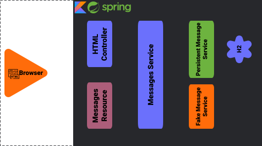

# Introduction 

In this hands-on tutorial, we're going to get familiar with the concept of building a server-side application with Spring Boot and Kotlin.
   
We'll learn how to:
 * Kotlin for Spring: Controllers, Data and Testing
 * Kotlin for Reactive Spring.
 * Best practice for Kotlin usage on the server-side
 
This tutorial is designed for those who have already had their hands on Spring MVC / WebFlux and want to see how much easier it is building server-side applications with Kotlin.
 
## Set-up

To start working on this tutorial, we'll need one of the latest versions of IntelliJ IDEA, so any version from 2018.1 onwards. You can download the latest free community version here.

Make sure version 1.3+ of the Kotlin plugin is installed. 
To update the Kotlin plugin, use `Tools | Kotlin | Configure Kotlin Plugin Updates`.
 
## Downloading project

Clone the repository from IntelliJ IDEA by choosing `VSC | Checkout from Version Control | Git` and specifying the project path: [http://github.com/kotlin-hands-on/kotlin-spring-chat](http://github.com/kotlin-hands-on/kotlin-spring-chat).

...or clone it from the command line:
```shell script
$ git clone http://github.com/kotlin-hands-on/kotlin-spring-chat
```

**Note** that the project includes the solutions branch, so it is possible to use the `Compare with branch` to compare your solution with the proposed one.
 
Alternatively, you can [download the project](https://github.com/kotlin-hands-on/kotlin-spring-chat/archive/initial.zip) directly (but only the main branch).

## Project Architecture Overview

Once we have the project set up, let's take a look at the general application overview. In this tutorial, we are going to build a simple chat application which has the following architecture:
  
 
  
As we may see from the diagram above, our application is an ordinary 3-tire web
 application, which has server-side rendering served by `HtmlController` as well
 as messages data API provided by `MessagesResource`. Also, this application has
 `MessagesService` which has two different implementations: 
 * `FakeMessageService` - first implementation which produces random messages  
 * `PersistentMessageService` - second implementation which works with real data
  storage
  
## Project Structure Overview

Finally, let have a quick overview of the future project structure:

```
\---src
    +---main
    |   +---kotlin
    |   |   \---com.example.kotlin.chat
    |   |       +---configurations
    |   |       |   // here will be sotred project configurations 
    |   |       +---controller
    |   |       |   \--- // here will be stored HtmlController.kt and MessageResource.kt
    |   |       +---extensions
    |   |       |   \--- // here will be stored MessageExtensions.kt
    |   |       +---service
    |   |       |   +---impl
    |   |       |   |   // here will be stored different implementations of the MessageService.kt
    |   |       |   +---vm // folder with withholding data view model 
    |   |       |   |   +---MessageVM
    |   |       |   |   +---UserVM
    |   |       |   \---MessageService.kt
    |   |       \---repository
    |   |           +---domain // holder for the domain objects 
    |   |           \--- // here will be stored MessageRepository.kt  
    |   \---resources     
    |       +---templates     
    |       |   \---templates     
    |       |       \---chat.html // thymeleaf html template     
    |       \---application.properties
    \---test
        \---kotlin
            \---com.example.kotlin.chat        
                \---ChatKotlinApplicationTests.kt        
```

As we may see from the folder structure displayed above, we have 3 main folders with which we will be working during the whole tutorial: 
 * `controller` - folder for storing `HtmlController` and `MessageResource`
 * `service` - folder for our service implementations. Note, the concrete implementations will be stored in the `impl` subfolder.
 * `repository` - folder, used to store domain objects and `Repository` implementation for the database access.
  
Apart from the 3 main folders, we have folders such as the `extensions` folder used to keep Kotlin extensions, and the `configurations` folder needed to store some extra spring configurations.   
  
So far, that is all we need to know for the beginning. Thus let's start our work on the first bits of the project!